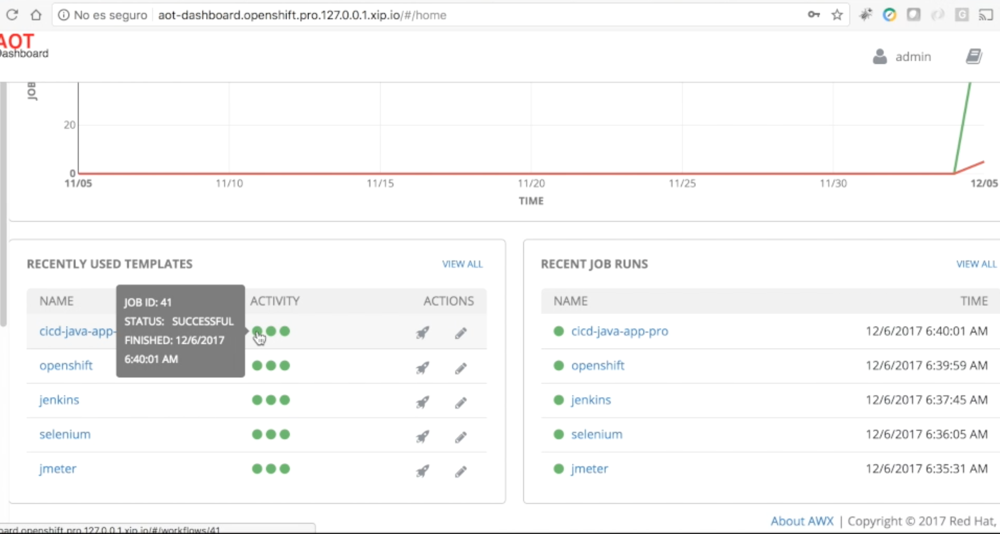
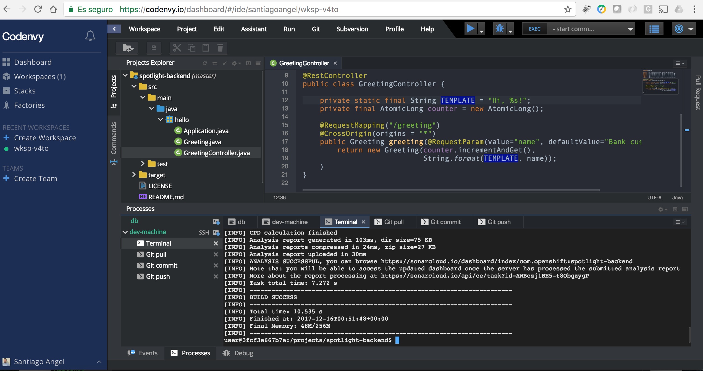
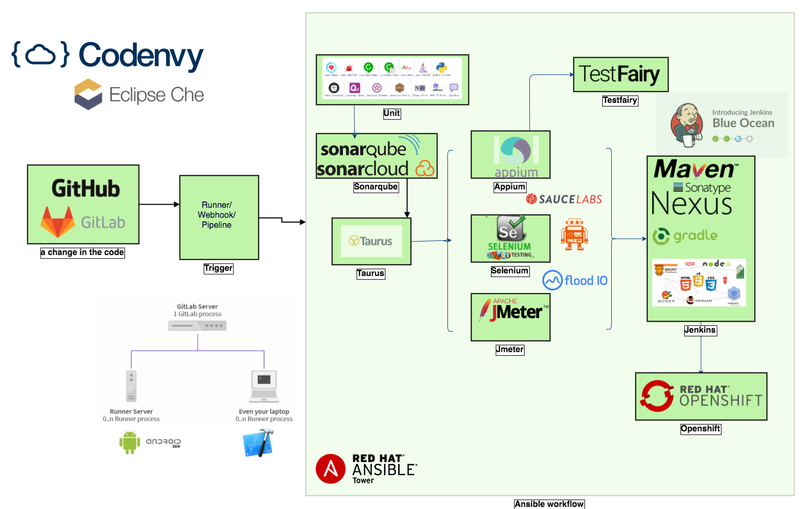
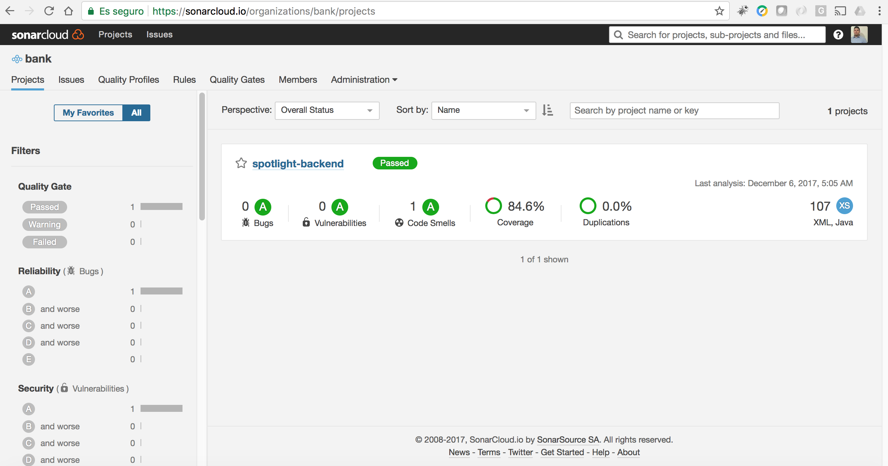
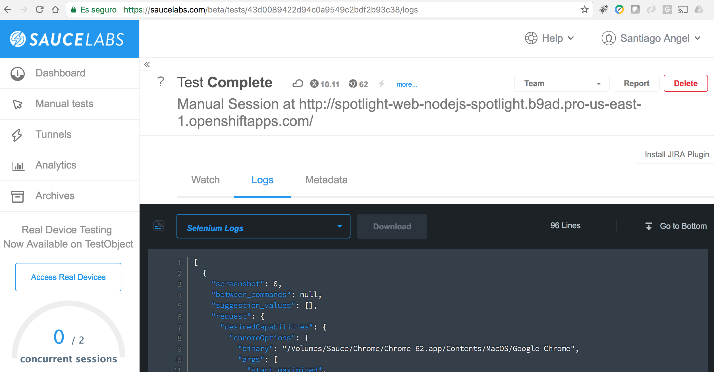
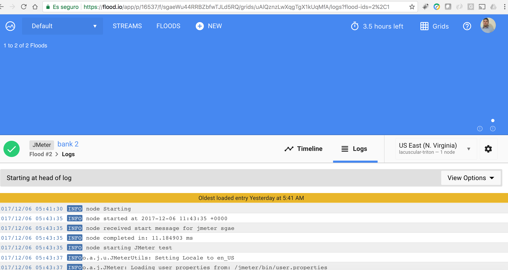
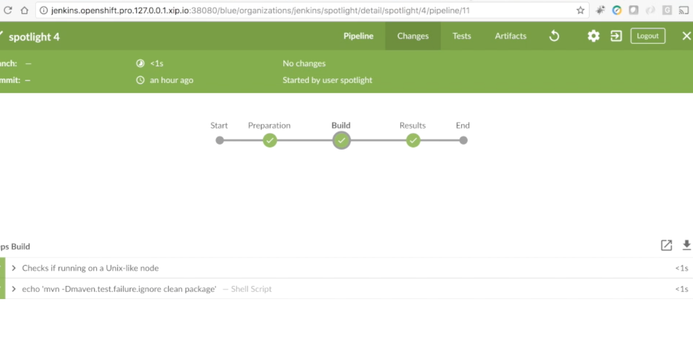
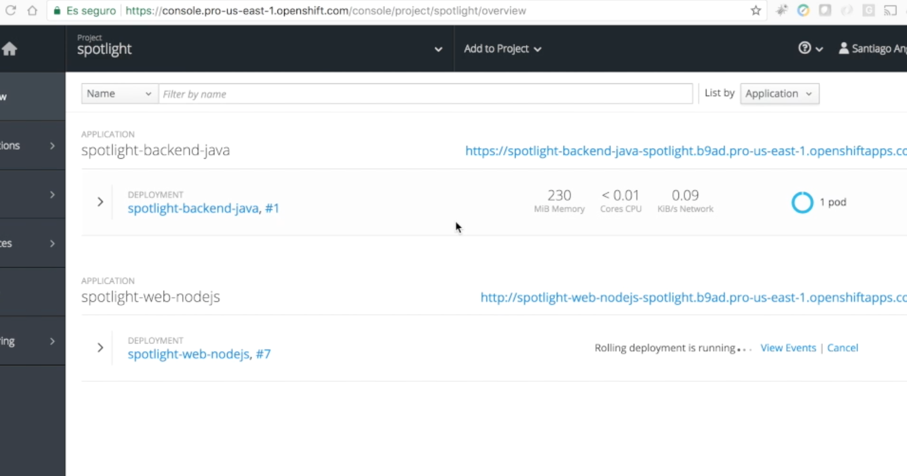
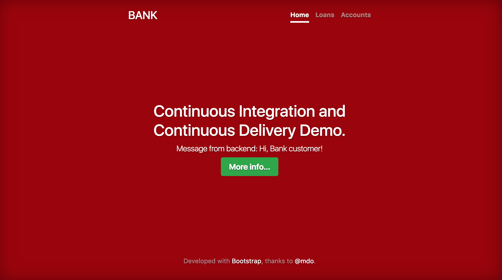

# Continuous Integration and Continuous Delivery Demo: from Code to Production with Ansible

This is a proposal that leverages the use of Ansible as an [orchestrator](https://www.ansible.com/use-cases/orchestration) of the [integration](https://www.ansible.com/overview/devops) and [continuous delivery](https://www.ansible.com/use-cases/continuous-delivery) processes.

## Video

## Flow

The flow begins when a developer makes a change in the code  and publishes it to the source code repository ([gitlab](https://about.gitlab.com/features/gitlab-ci-cd/) [github](https://developer.github.com/v3/guides/building-a-ci-server/) [bitbucket](https://bitbucket.org/AnsibleByRedHat/ansible-tower-pipelines)) hence a runner or webhook/ bitbucket pipeline identify the type of project, change, branch and different variables to call a [workflow](https://www.ansible.com/tower?wvideo=2uoh2d92ew) in ansible that includes the different steps (jobs) to complete the release.

### CI/CD Flow Diagram

## Steps (jobs)

Depending on the type of application, a workflow is executed and different jobs from [playbooks](http://docs.ansible.com/ansible/latest/playbooks.html) are launched:

* **unit** Unit tests.
* **sonarqube** Coverage tests and code analysis. 

* **taurus** Coordinator of execution of functional and load tests.
* **appium** Automation for Mobile Applications.
* **selenium** Functional tests in web. 
* **jmeter** Load tests. 
* **jenkins** Construction and publication of artifacts. 
* **testfairy** Distribution of *Mobile* Applications.
* **openshift** Publish web applications and services to PaaS. 

## Published application

http://spotlight-web-nodejs-spotlight.b9ad.pro-us-east-1.openshiftapps.com/

## Future

Integration with [CMDB](http://docs.ansible.com/ansible/latest/intro_dynamic_inventory.html), [Reporting](https://community.jaspersoft.com/project/jasperreports-server) servers, [agile project management](http://docs.ansible.com/ansible/latest/jira_module.html) tools and [analysis](https://www.ansible.com/splunk) [engines](https://github.com/openstack/ara). 
